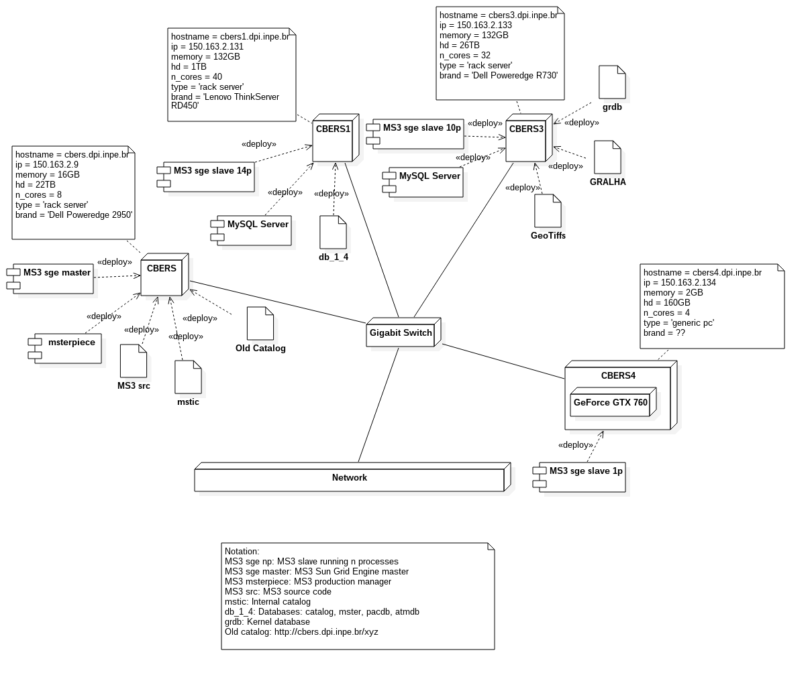

# Estação no INPE

 Estação de processamento - Subsistemas

* Gerente de produção
  * Configuração do sistema
  * Gerencia a fila de produção
  * Distribui as tarefas entre os hosts
  * Atende as requisições dos usuários
* Catálogo
  * Mostra as cenas catalogadas
  * Envia as requisições dos usuários
* Gerente executivo
  * Fornece estatísticas gerais

### Arquitetura e infraestrutura de armazenamento

