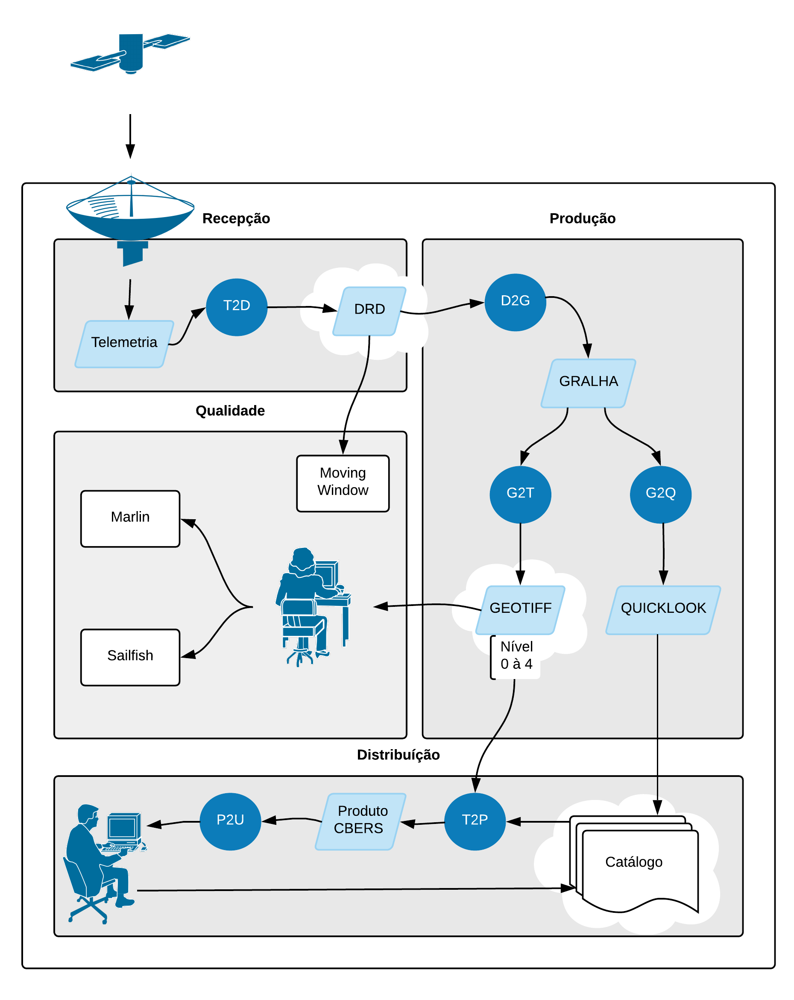

# Sobre o sistema MS³

O **MS³** \(Multi Satellite Station System\) é um sistema utilizado para realizar a ingestão, gravação e processamento de imagens de sensoriamento remoto, além de avaliar e controlar a qualidade dessas imagens, como por exemplo as imagens CBERS \([China-Brazil Earth Resources Satellite](cbers.md)\).

O principal objetivo do projeto é o barateamento do desenvolvimento e da operação do sistema de processamento de imagens de satélite do INPE, mantendo, ao mesmo tempo, um sistema flexível que permita a rápida adição de novos satélites e sensores. \(SILVA, M. A. O, 2007\)

O sistema foi construído com base em softwares e bibliotecas de código livre. Como por exemplo: Linux, GCC, Apache, Python, MySQL, as bibliotecas Tiff, GeoTiff, JPEG, HDF, XML, etc.

Ele processa dados dos seguintes satélites \(sensores\):

| **Satélites** | **Catálogo** | **Sensores** |
| --- | --- | --- | --- | --- | --- | --- | --- |
| CBERS-1 e CBERS-2  | antigo | CCD, IRMSS e WFI |
| CBERS-2B | antigo | CCD, HRC e WFI |
| Landsat -1, Landsat-2 e Landsat-3  | antigo | MSS |
| Landsat-4 e Landsat-5  | antigo | MSS e TM |
| Landsat-7 | antigo | ETM |
| CBERS-4  | novo | AWSI, IRS, MUX, PAN5M, PAN10M |
| Landsat-8  | novo | OLI |

Atualmente existem duas bases responsáveis pela recepção dos dado de satélites, sendo elas uma base instalada em _Cuiabá_ e outra em _Cachoeira Paulista_. Cada uma delas possui um conjunto de antenas dispostas para receber dados de determinados satélites, como:

| **Antenas** | **Desde\(Ano\)** | **Satélites** |
| --- | --- | --- | --- | --- | --- | --- | --- |
| CB1 \(1.5m Banda L\) | 2013 | METOP-B, NOAA-15, NOAA-18, NOAA-19, FENGYUNG |
| CB10 \(10m Banda X e S\) | 1982 | AQUA, TERRA, CBERS-4, LANDSAT-7, RESOURCESAT-2 |
| CB11 \(11.28m Banda X\) | 1998 | AQUA, TERRA, CBERS-4, LANDSAT-7, NPP, LANDSAT-8, RESOURCESAT-2 |
| CP1 \(1.8m Banda L\) | 2012 | METOP-B, NOAA-15, NOAA-18, NOAA-19 |
| CP2 \(1.5m Banda L\) | 2013 | NOAA-15, NOAA-18, NOAA-19 |
| CP3 \(2.5m Banda L\) | 2014 | GOES-13 |
| CP5 \(5.4m Banda X\) | 2009 | AQUA, TERRA, NPP, CBERS-4 |

### Principais subsistemas

O **MS³** apresenta quatro sistemas principais: sistema de _Ingestão e Gravação_, de _Processamento_, de _Disseminação_ e de _Avaliação e Controle de Qualidade_. 

O **Sistema de Ingestão e Gravação** é responsável pela ingestão e gravação dos dados transmitidos pelos satélites, onde a partir de um arquivo TLE \(two-line elements\), que contém informações de órbita do satélite, são determinados data e horários de início e término da passagem, com esses dados todas as passagens são agendadas automaticamente para gravação. Os dados ingeridos são gravados em arquivos no formato DRD \([Dated Raw Data](tipos-de-dados.md#drd)\). As operações de planejamento, manutenção das gravações, verificação das operações realizadas, gravação e transferência dos dados, são realizadas a partir de uma ferramenta de controle do sistema de ingestão.

Durante a ingestão é possível a visualização em tempo real dos dados através da ferramenta _Moving Window_, onde além da imagem ela apresenta as informações do satélite, do canal e os dados da recepção \(identificação do satélite, time-code, time-stamp, e configuração de bandas\). Os dados ingeridos também podem ser visualizados remotamente.

O **Sistema de Processamento** é responsável pela geração das imagens em diferentes níveis de processamento. Podem ser gerados cinco produtos diferentes por este sistema: 

* Imagem Nível 0: imagem bruta, sem tratamento, armazenada juntamente com os dados de calibração radiométrica e os parâmetros orbitais, entre outros;
* Imagem Nível 1: imagem com correção radiométrica, onde o cabeçalho do arquivo contém informações geográficas básicas, tais como coordenadas geodésicas dos cantos e do centro da cena;
* Imagem Nível 2: imagem com correção radiométrica e correção geométrica de sistema; 
* Imagem Nível 3: imagem com correções radiométrica e geométrica de sistema, refinada pelo uso de pontos de controle; 
* Imagem Nível 4: imagem com correções radiométrica e geométrica de sistema, refinada pelo uso de pontos de controle e de um MNET \(Modelo Numérico de Elevação do Terreno\). 

As imagens nos níveis de processamento 1 a 4 são geradas no formato [GeoTiff ](tipos-de-dados.md#tiff-e-geotiff)acompanhadas de um arquivo de metadados no formato XML. A imagem nível 0 é gerada no formato GRALHA \([Generic Raw Level Hierarchical Archive](tipos-de-dados.md#gralha)\), um formato desenvolvido para o armazenamento de dados brutos decodificados. O processamento é dívido em módulos, que serão melhor explicados ao longo do documento.

 O **Sistema de Disseminação \(Catálogo\)** é responsável pela distribuição dos produtos. Essa distribuição é feita pela internet a partir do [Catálogo de Imagens](http://www.dgi.inpe.br/CDSR/) onde o usuário, a partir das ferramentas de consulta do catálogo, identifica as imagens desejadas e faz o pedido. As informações a respeito do processamento do pedido e o endereço para download das imagens via FTP são fornecidas via e-mail.

O **Sistema de Avaliação e Controle de Qualidade** é formado por dois aplicativos que possuem quatro objetivos principais: visualização, avaliação, análise e simulação. 

O primeiro aplicativo é o _Marlin_ um sistema distribuído gratuitamente para os usuários de imagens de satélites. O sistema pode trabalhar com imagens de qualquer satélite, independente da tecnologia do sensor e das resoluções espacial e radiométrica. O principal objetivo desta distribuição é fazer com que o sistema de processamento seja constantemente aprimorado para eliminar os problemas identificados e reportados pelos usuários \(SILVA, M. A. O, 2007\). 

O segundo aplicativo é o _Sailfish_, que está integrado ao primeiro sistema e aos modelos geométricos do MS³. Ele permite que o analista altere parâmetros do sistema como, por exemplo, os da geometria do sensor, dados orbitais, comparando resultados obtidos por diferentes fontes de efemérides e atitude, sempre no sentido de identificar uma melhoria para o sistema de geração de produtos. \(SILVA, M. A. O, 2007\)

### Funcionamento Geral:

### Visão detalhada:

